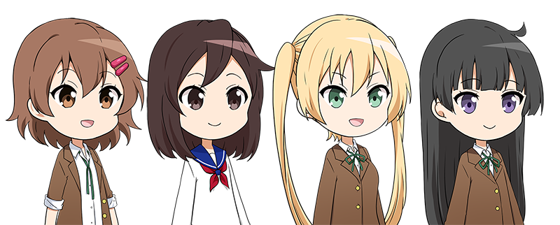
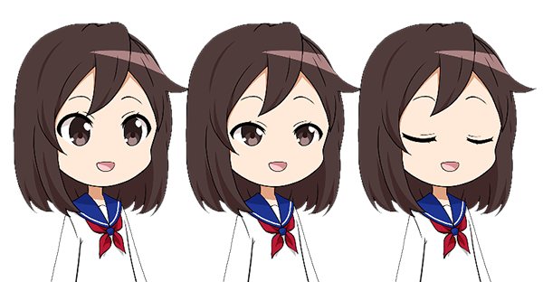
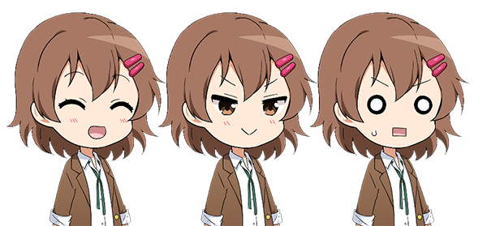
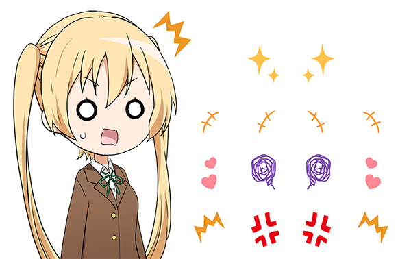

# 珠音ちゃん・プロ生ちゃん SD 上半身コラボ素材
Tamane x Pronama-Chan collaboration materials

HSP3オフィシャルキャラクター"珠音（たまね）ちゃん"、プロ生ちゃんとそのお友達をSDキャラクター素材として公開しているリポジトリです。  
らぐほのえりかさん( https://www.ragho.net/ )により描かれたイラスト素材を、ゲームの製作や、動画などのコンテンツ製作にお使い頂けます。
豊富なキャラクターと表情の差分、表示するためのサンプルコードも用意されています。

# キャラクター

左から「プロ生ちゃん(暮井 慧)」「珠音ちゃん」「フィネス・ヒルヴィレッジちゃん」「戸増千由莉ちゃん」のキャラクターが用意されています。(それぞれ右向き、左向きを選択できます)

# バリエーション

目や口、眉などをアニメーションで動かすことが可能です。

すべてのキャラクターには特殊な表情差分が用意されています。

さらに豊かな表現を行うためのアイコン(漫符)がオマケとして用意されています。

# フォルダ詳細

original_data フォルダ

オリジナルの.psd(Photoshop)データが収録されています

png フォルダ

それぞれのキャラクターごとの画像素材、及び表情差分をまとめたファイルが収録されています

sample フォルダ

実際に素材を表示するためのサンプルコードが収録されています

images フォルダ

サンプル用の画像が収録されています

# サンプルコードについて

HSP3.6以降向けのスクリプトが用意されています。随時アップデートを行っていく予定です。
不具合や要望などあれば、Issueにてお知らせください。
HSP3以外のコードがあれば、Pull Requestして頂ければ追加致します。

# 珠音ちゃんについて

HSP3オフィシャルキャラクター"珠音（たまね）"、およびHSP3(Hot Soup Processor)についてはこちらをご覧ください

https://hsp.tv/make/tamane2d.html
(C) HSPTV!/onion software

珠音ちゃんキャラクター原案は、オガワコウサク(チームグリグリ)氏によりデザインされました。  
オガワコウサク(チームグリグリ) http://www.gris2.com/

# 利用ガイドライン

プロ生ちゃん、及びプロ生ちゃんコラボ素材は、プロ生ちゃん利用ガイドラインに従って利用してください。

https://kei.pronama.jp/guideline/
©︎ Pronama LLC

「珠音ちゃん・プロ生ちゃん SD 上半身コラボ素材（イラスト: らぐほのえりか）」追記事項  
・利用ガイドラインに、キャラクター「珠音ちゃん」を加えて解釈してください。  
・表情・服装などを、ご自身で追加・改変し、パターンを補い作品に用いても構いません。  
・商品の制作や素材としての公開は、原則禁止とし、制作前に許諾が必要です。  

-------------------------------------------------------------------------------
Hot Soup Processor (HSP)
Copyright (C) 1997-2023, Onion Software/onitama, xMade with base technology of OpenHSP.
https://github.com/onitama/OpenHSP

